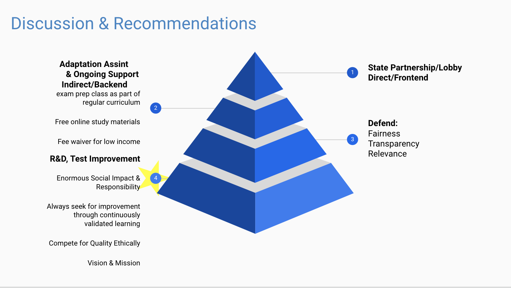

## Improve SAT Participation Rate in the State of Nevata

### Overview
The new format for the SAT was released in March 2016. As an employee of the College Board - the organization that administers
the SAT - I am a part of a team that tracks statewide participation and recommends where money is best spent to improve SAT
participation rates. This presentation and report is geared toward **non-technical** executives with the College Board
and will use the past two years of test data and outside research to make recommendations about how the College Board might work to increase the participation rate in the state of Nevata.

### Directory Structure
Project-improve_SAT_participation_rate_in_Nevata
code
- project_work_book.ipynb     
data
- act_2017.csv
- act_2018.csv
- sat_2017.csv
- sat_2018.csv
- combined_2017.csv
- combined_2018.csv
- final.csv
images
- recommendations.png
Presentation-Means_to_Improve_SAT_Participation Rate_for_Nevata.pdf
README.md

### Data
This project has two provided 2017 test score datasets, the 2018 test score datasets were obtain through SAT and ACT official
website. Through the project, three new combined datasets were generated.

Provided
- [2017 SAT Scores](./data/sat_2017.csv)
- [2017 ACT Scores](./data/act_2017.csv)

Obtained
- [2018 SAT Scores](./data/sat_2018.csv)
- [2018 ACT Scores](./data/ACT_2018.csv)

Generated
- [Combined 2017 Scores](./data/combined_2017.csv)
- [Combined 2018 Scores](./data/combined_2018.csv)
- [Combined All Scores](./data/final.csv)

#### Description of Datasets (final.csv)
| Feature              | Type    | Dataset      | Description                 |
|----------------------|---------|--------------|-----------------------------|
| state                | object  | sat_2017.csv | Name of the state           |
| 17_sat_participation | float64 | sat_2017.csv | 2017 SAT Participation Rate |
| 17_sat_ebrw          | int64   | sat_2017.csv | 2017 SAT Verbal Score       |
| 17_sat_math          | int64   | sat_2017.csv | 2017 SAT Math Score         |
| 17_sat_total         | int64   | act_2017.csv | 2017 SAT Total Score        |
| 17_act_participation | float64 | act_2017.csv | 2017 ACT Participation Rate |
| 17_act_english       | float64 | act_2017.csv | 2017 ACT English Score      |
| 17_act_math          | float64 | act_2017.csv | 2017 ACT Math Score         |
| 17_act_reading       | float64 | act_2017.csv | 2017 ACT Reading Score      |
| 17_act_science       | float64 | act_2017.csv | 2017 ACT Science Score      |
| 17_act_composite     | float64 | act_2017.csv | 2017 ACT Composite Score    |
| 18_sat_participation | float64 | sat_2018.csv | 2018 SAT Participation      |
| 18_sat_ebrw          | int64   | sat_2018.csv | 2018 SAT Verbal Score       |
| 18_sat_math          | int64   | sat_2018.csv | 2018 SAT Math Score         |
| 18_sat_total         | int64   | sat_2018.csv | 2018 SAT Total Score        |
| 18_act_participation | float64 | ACT_2018.csv | 2018 ACT Participation Rate |

### Findings
#### Colorado, Illinois, and West Virginia are three states show interesting trends for SAT participation rate.
Colorado, Illinois, and West Virgina shows siginificant increase in SAT participation rate. Both Colorado and Illinois also shown significant decrease in ACT participation rate. See the new bar chart below. After investigation, these three states are the three most recent states that awarded College Board contracts for making SAT the standardized high-school test for the states. The states are providing the SAT not only as college entrance exam, but also as a measure of school achievement.

### Recommendation

